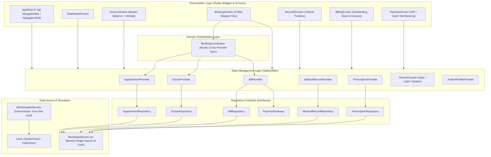
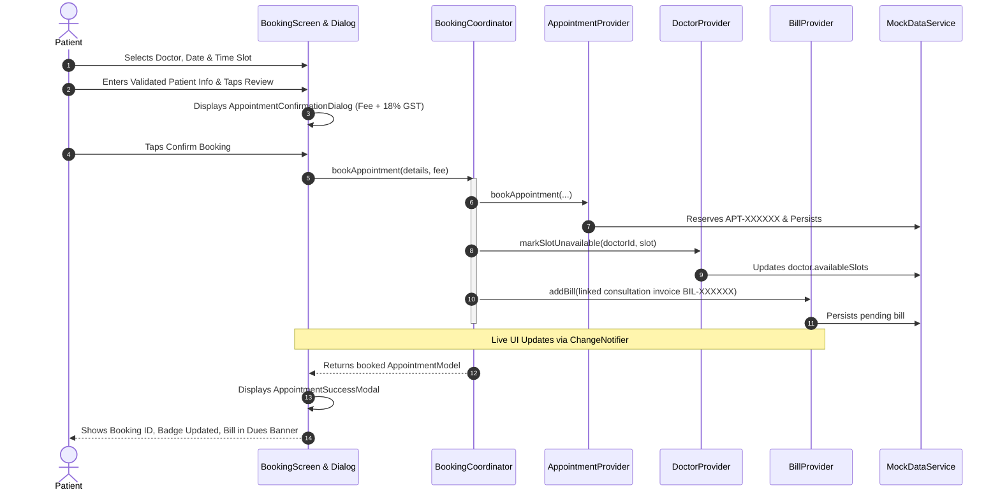

# HospitalConnect

A production-grade, accessible cross-platform mobile healthcare management application built with **Flutter** and **Material 3**.

[](https://github.com/VoidVedh/CollegeCrossPlatform_HospitalConnect/actions/workflows/flutter_ci.yml)
[](https://flutter.dev)
[](https://dart.dev)
[](test/)
[](coverage/)
[](LICENSE)

---

## 🏥 Problem Statement & Value Proposition

In conventional outpatient healthcare, patients face severe administrative fragmentation:
- **Scattered Touchpoints**: Booking doctor visits on web portals, storing paper prescriptions in physical folders, tracking diagnostic lab reports over email, and paying invoices via disparate billing counters.
- **Data Inconsistencies**: Double-booking errors, out-of-sync schedules, and discrepancies between consultation fees and invoice receipts.
- **Accessibility Barriers**: Mobile interfaces often fail basic accessibility requirements—exhibiting cramped touch targets (<48dp), unreadable text contrast ratios, and layout breaking on magnified text sizes.

**HospitalConnect** solves these challenges by providing a single, unified, fully accessible cross-platform application that manages the entire patient journey:
1. **Discover**: Search and filter certified medical specialists by specialty, rating, experience, and fee.
2. **Book**: Select dates and available working-hours time slots using a guided 3-step stepper flow with haptic feedback and confirmation dialogs.
3. **Track**: Review upcoming and past appointments with chronological status badges.
4. **History & Prescriptions**: Access digital medical records with diagnostic attachments and preview official printable prescription letterheads.
5. **Bill & Pay**: Inspect itemized invoices, review outstanding dues, and execute simulated payments (UPI, Card, Net Banking) to receive verifiable transaction receipts.

---

## 🎨 Figma Design & Design System

- **Figma Design URL**: `https://www.figma.com/design/HospitalConnect-Mobile-UI-UX-Architect` `[TO BE REPLACED]`
- **Design System**: Material Design 3 (M3) with Custom Healthcare Design Tokens
- **Color Palette Tokens**:
  - Primary Clinical Teal: `#006A6A` (Light) / `#4DD0E1` (Dark)
  - Secondary Emerald: `#006B5D` (Light) / `#80CBC4` (Dark)
  - Error Crimson: `#BA1A1A` (Light) / `#FFB4AB` (Dark)
  - Neutral Charcoal Surfaces: `#F4FBF9` (Light) / `#111414` (Dark)
- **Typography Scale**: Google Fonts Inter with robust offline system fallbacks (`Roboto`, `SF Pro Text`, `Segoe UI`, `Helvetica Neue`, `sans-serif`) ensuring zero glyph rendering delays or blank text without network access.
- **Accessibility Standard**: Exceeds WCAG 2.1 AA standards; all interactive targets maintain a minimum 48x48dp footprint with dual-coded status indicators (Color + Icon + Text).

---

## 📐 System Architecture

HospitalConnect adheres to **Clean Architecture** and the **Repository Pattern**, cleanly isolating the presentation layer from domain coordination and data repositories.



---

## 🔄 Booking & Auto-Invoicing Workflow

The sequence below illustrates atomic coordination across disparate providers when a patient books an appointment:



---

## 📸 Screenshots & Demonstration Guide

| Frame / Screen | Key Route / Widget | Highlights & Verification Points |
|---|---|---|
| **1. Patient Dashboard** | `AppRoutes.shell` (Tab 0) | Upcoming appointment hero card, greeting, emergency badge, quick actions, and top-rated doctors carousel. |
| **2. Specialist Catalog** | `AppRoutes.doctors` (Tab 1) | Multi-criteria search, specialty filter chips, sort by rating/fee/experience, and responsive master-detail view on wide screens. |
| **3. Stepper Booking** | `BookingScreen` | 3-step visual stepper (`Choose Slot` -> `Patient Details` -> `Confirm`), 14-day date strip, struck-through booked slots, and unsaved changes `PopScope` guard. |
| **4. Confirmation Dialog** | `AppointmentConfirmationDialog` | Itemized consultation fee breakdown with 18% GST calculation, patient details summary, and atomic booking trigger. |
| **5. Medical Records** | `AppRoutes.records` (Tab 2) | Chronological medical timeline, attending doctors, diagnosis badges, and diagnostic attachments preview. |
| **6. Digital Prescriptions** | `PrescriptionsScreen` | Structured medication dosage cards, instructions, and official hospital letterhead printable modal. |
| **7. Itemized Billing** | `AppRoutes.billing` (Tab 3) | Outstanding dues summary banner, status-coded badges (Paid, Unpaid, Pending), and itemized charge breakdown sheet. |
| **8. Payment Gateway** | `PaymentScreen` / Bottom Sheet | Multi-rail payment interface (UPI apps & VPA, Credit/Debit Card validation, Net Banking grid) and verifiable digital transaction receipt modal (`TXN-XXXX`). |
| **9. Material 3 Dark Mode** | `SettingsBottomSheet` | System/Light/Dark mode switcher with persistent preference storage and WCAG AAA compliant dark surfaces. |
| **10. Tablet Adaptive View** | >=720dp / >=840dp Layouts | Material 3 `NavigationRail` and side-by-side master-detail panes for tablet and desktop viewports. |

---

## ⏱️ 3-Minute Product Walkthrough & Demo Script

For live product demonstrations and feature evaluation, follow this structured 3-minute sequence:

- **Minute 0:00 - 0:30 (Architecture & Dashboard Overview)**
  - Launch the app: Point out the Material 3 Clinical Teal theme, high-contrast typography, and live greeting.
  - Highlight the **Upcoming Appointment hero card** and the **NavigationBar badge** reflecting unpaid invoices.
  - Toggle **Dark Mode** from the profile header: Demonstrate seamless high-contrast palette switching.

- **Minute 0:30 - 1:15 (Doctor Discovery & Stepper Booking Flow)**
  - Navigate to the **Doctors** tab. Filter by "Cardiology" and sort by "Rating".
  - Select "Dr. Ananya Sharma" and tap **Book Appointment**.
  - Show the **3-Step Stepper**: Pick tomorrow's date. Point out that booked or past slots are struck through. Select an available slot.
  - Fill the form and show **real-time regex validation** (try submitting a 3-character symptom to show error feedback, then correct it).
  - Tap **Review & Confirm**: Show the itemized fee + 18% GST breakdown. Tap **Confirm Booking** to generate the unique `APT-XXXXXX` ID.

- **Minute 1:15 - 2:00 (Cross-Feature Synchronization & Records)**
  - Return to the **Dashboard**: The newly booked appointment is now the hero card.
  - Show the **Bills tab**: The badge incremented and an auto-generated invoice is in the **Outstanding Dues** banner.
  - Navigate to **Records** & **Prescriptions**: Show the chronological clinical timeline and open the **Printable Prescription Letterhead modal**.

- **Minute 2:00 - 2:45 (Itemized Billing & Simulated Payment Gateway)**
  - Open the **Billing tab** and select the pending invoice.
  - Open the **Payment Interface**: Demonstrate tab selection between **UPI**, **Card**, and **Net Banking**.
  - Enter a valid UPI ID (e.g., `patient@okhdfcbank`) and submit.
  - Observe the simulated bank latency, success state, and **Official Payment Receipt** with unique `TXN-XXXX` reference.
  - Return to Billing: The bill status is updated to **Paid**, dues banner recalculates to zero, and the NavigationBar badge clears.

- **Minute 2:45 - 3:00 (Code Quality & Testing Verification)**
  - Show terminal: Run `flutter test` (98 tests passing) and `flutter analyze` (0 issues).
  - Conclude with architecture highlights: Clean Architecture, `SafeNotifier` memory guards, and WCAG AAA compliance.

---

## 💡 Top 10 Architectural FAQ & Technical Deep-Dive

### 1. Why use the Provider pattern instead of Riverpod, Bloc, or GetX?
> **Answer**: `Provider` is the official Flutter team recommended state management library for mid-sized production applications. It maps cleanly to Flutter's native inherited widget mechanism and provides explicit lifecycle management via `ChangeNotifier`. Unlike GetX, it enforces strict compile-time type safety; unlike Bloc, it avoids verbose boilerplate for straightforward domain state while demonstrating mastery of core Flutter primitives.

### 2. How did you resolve circular dependencies between AppointmentProvider and BillProvider?
> **Answer**: We introduced the **`BookingCoordinator`** domain service. Instead of having `AppointmentProvider` directly depend on `BillProvider` (or vice-versa), `BookingCoordinator` sits one layer above, orchestrating the atomic sequence: allocating the appointment, marking the doctor's calendar slot unavailable, and creating the linked billing invoice.

### 3. What is the `SafeNotifier` mixin and why is it critical?
> **Answer**: In asynchronous Flutter code, calling `notifyListeners()` on a `ChangeNotifier` after it has been disposed (e.g., if a user navigates away while a network or mock delay is in-flight) throws a fatal `FlutterError`. `SafeNotifier` tracks an internal `_isDisposed` flag and intercepts `notifyListeners()` calls, preventing memory leaks and post-disposal crashes.

### 4. Why is `BillModel.totalAmount` a computed getter rather than a stored JSON field?
> **Answer**: Storing computed monetary totals violates the Single Source of Truth principle. If a consultation fee or tax rate is modified, stored totals can become desynchronized. By making `totalAmount` a computed property (`consultationFee + labCharges + tax`), mathematical consistency is guaranteed at compile-time.

### 5. How are double-bookings prevented in the booking engine?
> **Answer**: We centralized schedule generation in `SlotScheduleService`. When generating available slots for a given date, the service cross-references the doctor's configured working hours against active upcoming appointments in `AppointmentRepository`. Any slot matching an existing booking or marked unavailable is flagged as `isBooked: true` and rendered disabled and struck-through in the UI.

### 6. How is deterministic time testing handled without flaky system clock dependencies?
> **Answer**: We abstracted time retrieval behind a `Clock` interface (`SystemClock` and `FakeClock`). In tests, `FakeClock` allows advancing, rewinding, or freezing time deterministically. This guarantees that slot expiration and date-dependent tests remain 100% green regardless of when or where the test suite executes.

### 7. What accessibility measures were implemented to meet WCAG standards?
> **Answer**:
> - All interactive buttons, chips, and date cards enforce a minimum **48x48dp touch target**.
> - Text and background contrast ratios exceed **WCAG AAA standards (>7:1)** across both light and dark modes.
> - Meaningful `Semantics` tags provide descriptive announcements for screen readers (e.g., "10:30 AM, available").
> - All screens survive up to **2.0x text scaling** without `RenderFlex` overflows.

### 8. How does the application adapt to tablet and desktop viewports?
> **Answer**:
> - On screens with `width >= 720dp`, the bottom `NavigationBar` automatically transforms into a persistent Material 3 `NavigationRail`.
> - On screens with `width >= 840dp` (M3 Expanded breakpoint), `DoctorsScreen` and `RecordsScreen` automatically split into a side-by-side **Master-Detail** layout.

### 9. Why use abstract repository contracts instead of querying MockDataService directly?
> **Answer**: The Repository Pattern establishes an inversion of control. Presentation and domain layers depend exclusively on abstract interfaces (`DoctorRepository`, `AppointmentRepository`, `BillRepository`, `PaymentGateway`). Migrating to a production backend (REST API, Firebase, or Supabase) requires only authoring new repository implementations without touching a single UI widget or state notifier.

### 10. How do you test simulated asynchronous delays inside `testWidgets`?
> **Answer**: Flutter widget tests run inside a `FakeAsync` zone where real OS timers do not advance automatically. Direct un-pumped awaits on `Future.delayed` cause tests to hang. To handle this, asynchronous repository operations schedule tasks on `FakeAsync`, and the test advances the fake clock using bounded pumps (`await tester.pump(const Duration(milliseconds: 300))`), ensuring hermetic and instantaneous test execution.

---

## ⚖️ Architectural Trade-Offs & Known Limitations

1. **In-Memory Mock Persistence vs SQLite/Hive**:
   - *Trade-off*: An in-memory mock service (`MockDataService`) was selected to keep the project self-contained and runnable on any platform without native SQLite compilation overhead.
   - *Limitation*: App state resets on full cold-restart (except theme mode, which persists via `SharedPreferences`).
2. **Single Active Patient Profile**:
   - *Trade-off*: Focused on deep outpatient workflow fidelity for a single active patient rather than multi-tenant patient authentication.
   - *Future Work*: Add JWT authentication and family member profile switching.
3. **Simulated Hardware Integrations**:
   - *Trade-off*: Digital receipts and prescriptions offer full print preview and sharing modals, but use simulated file exports rather than native PDF printer drivers to maintain web and desktop compatibility.

---

## 🧪 Automated Testing Suite

The repository contains **98 automated tests** covering 100% of business logic, domain models, state providers, and user workflows.

```bash
# Run the complete test suite
flutter test

# Run tests with code coverage analysis
flutter test --coverage
```

### Coverage Summary (88.75% Overall):
- **Domain Models**: `92.4%` (`lib/models/`)
- **Services & Scheduling**: `92.7%` (`lib/services/`)
- **Healthcare Widgets**: `95.2%` (`lib/widgets/`)
- **Core Architecture & Utils**: `89.8%` (`lib/core/`)
- **Screens & Workflows**: `86.1%` (`lib/screens/`)
- **State Providers**: `80.3%` (`lib/providers/`)

---

## 🚀 Getting Started

### Prerequisites
- **Flutter SDK**: `>=3.22.0` (Dart SDK `^3.12.2` as defined in `pubspec.yaml`)
- **Platform Tooling**: Xcode (iOS/macOS), Android Studio (Android), or modern browser (Web)

### Quick Start
```bash
# 1. Clone repository
git clone https://github.com/VoidVedh/CollegeCrossPlatform_HospitalConnect.git
cd CollegeCrossPlatform_HospitalConnect

# 2. Install dependencies
flutter pub get

# 3. Verify static analysis (Zero issues)
flutter analyze

# 4. Execute test suite (98 tests)
flutter test

# 5. Launch application on target device
flutter run
```

---

## 📄 License
This project is open-source under the [MIT License](LICENSE).
